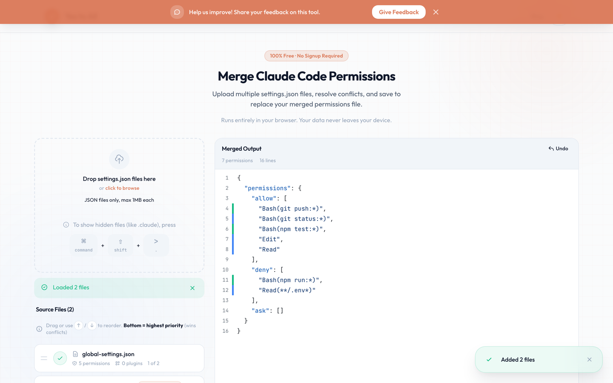

# Yes to All — Claude Code Permissions Manager

**Live at [y2all.com](https://www.y2all.com)**

Claude Code saves approved permissions per project, so the same rules end up scattered across many `.claude/settings.json` files. Yes to All merges them: upload or paste any number of settings files, review the combined output in a diff-style view, resolve conflicts where files disagree, and export one clean `settings.json`. Everything runs in the browser — no account, no server, no data leaves your device.



## Features

- Drag-and-drop or paste multiple `settings.json` files, with validation and duplicate detection
- Priority-ordered merging — reorder files to control which wins on conflicts
- Conflict detection when the same rule appears under different categories (`allow` / `deny` / `ask`)
- Diff-style output with per-line delete and re-categorize, with undo
- Copy, download, or save the merged result via the File System Access API
- MDX blog covering how Claude Code permissions actually work

## Stack

React 18 + TypeScript, Vite, Tailwind CSS, Framer Motion, React Router, MDX. Deployed on Vercel; a single serverless function (`api/feedback.ts`) powers the feedback form via Resend.

## Local development

```bash
git clone https://github.com/mheggie-magnet/claude-permissions-manager.git
cd claude-permissions-manager
npm ci
cp .env.local.example .env.local   # only needed for the feedback form
npm run dev
```

The app itself has no backend dependencies; `RESEND_API_KEY` is only required to send feedback emails through the Vercel function.

## Tests

```bash
npm test           # Vitest unit + component tests
npm run test:e2e   # Playwright smoke tests (builds and serves a preview)
npm run lint       # ESLint
npm run typecheck  # tsc --noEmit
```

## Project structure

```
api/               Vercel serverless function (feedback form)
e2e/               Playwright smoke tests
src/
  components/      UI components (upload, merge preview, diff output, blog)
  hooks/           State management (multi-file merge, uploads, theme)
  utils/           Core logic: JSON parsing, merge/conflict detection, export
  content/blog/    MDX blog posts
  pages/           Routes: Home, Blog, BlogPost
```

## License

[MIT](LICENSE) © Mike Heggie
